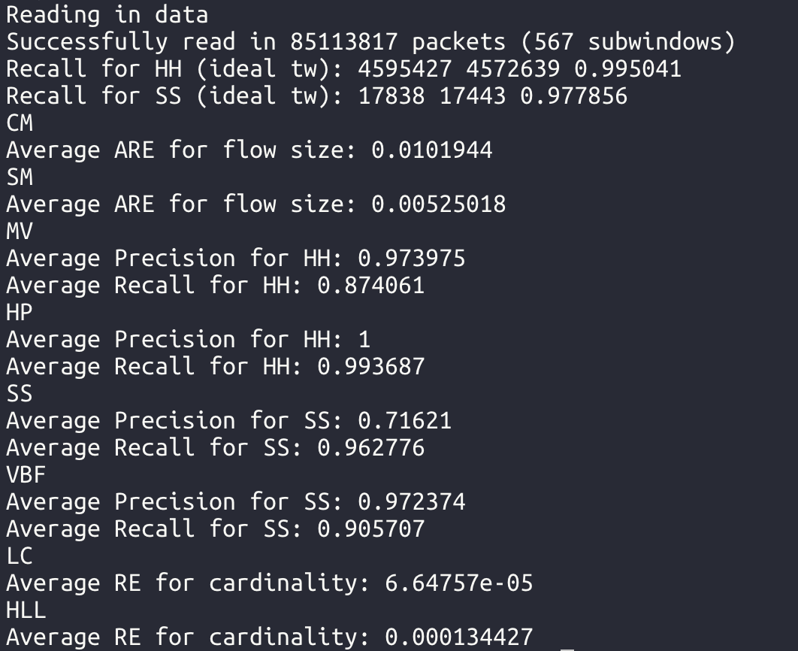
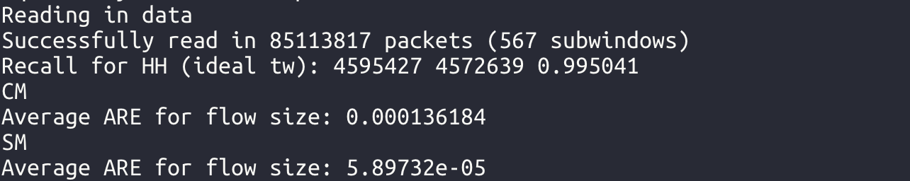

# (Exp #2) Sketch-based algorithms

### Requirements

CMake 3.11 or higher.

You can run the simulation on any host.


### Build the project

+ Make sure you are at `${OmniWindow_DIR}/Exp-2/`
+ Run the script `build.sh`

+ The executable files are created under the directory of `bin`
+ The file `exp_tumbling` is the executable file for tumbling windows w/w.o. C&R overhead

+ The file `exp_omni` is the executable file for Omni Sliding Window and Omni Tumbling Window
+ The file `exp_sliding` is the executable file for Sliding Sketch


### Run the project

You can run the following commands:

```shell
# Make sure you are at ${OmniWindow_DIR}/Exp-2/
cd bin
./exp_xxx algorithm1 algorithm2 ... data_path
```

+ `exp_xxx` can be `exp_omni`, `exp_tumbling` and `exp_sliding`.
+ After specify the executable file name, you can input any number of algorithms you want to test, or input `all` to run all the supported algorithms.
+ The last parameter of this command is the path of data, which could be `${OmniWindow_DIR}/data/trace.bin`.

The valid algorithms are listed below.

#### The supported algorithms

| Algorithms               | Valid algorithm name |
| ------------------------ | -------------------- |
| CM Sketch                | CM                   |
| SuMax Sketch             | SM                   |
| MV Sketch                | MV                   |
| HashPipe                 | HP                   |
| Spread Sketch            | SS                   |
| Vector Bloom Filter      | VBF                  |
| Linear Counting          | LC                   |
| HyperLogLog Counting     | HLL                  |
| All the algorithms above | all                  |

#### Example 1:

```
./exp_tumbling all ../../data/trace.bin
```

The results are printed on the screen:



#### Example 2:

```
./exp_omni CM SM ../../data/trace.bin
```

The results are printed on the screen:



#### Configurations

The configuration file is `include/config.h`.

Users can edit this file to configure the memory of supported algorithms, window size, sub-window size and etc.

#### Notes

To run the experiments of TW1, uncomment lines 31~34 in `include/tumblingWindowSketch.h` and rebuild the project.

To run the experiments of TW2, comment lines 31~34 in `include/tumblingWindowSketch.h` and rebuild the project.

To run the experiments of OTW, comment line 55, uncomment line 54 in `include/omniWindowSketch.h` and rebuild the project.

To run the experiments of OSW, comment line 54, uncomment line 55 in `include/omniWindowSketch.h` and rebuild the project.
